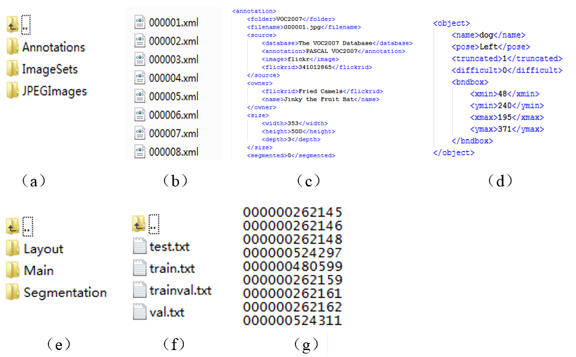
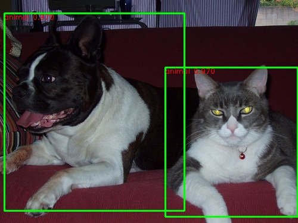
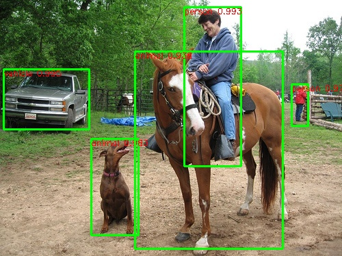
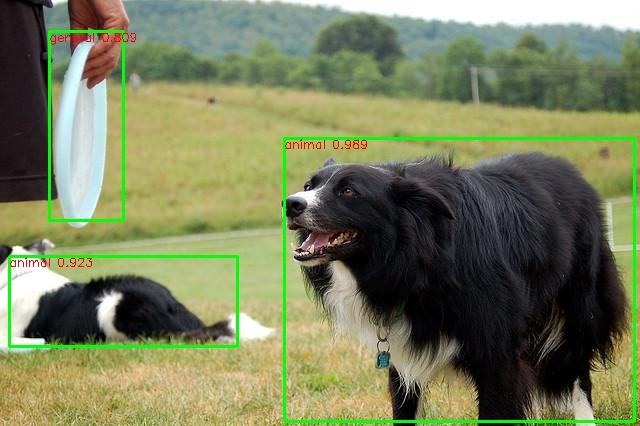
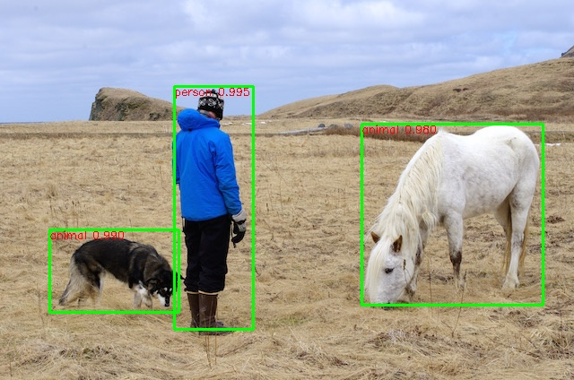
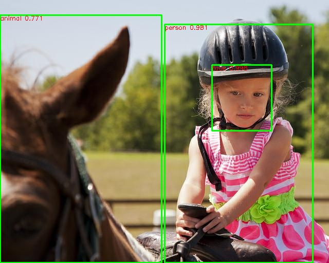
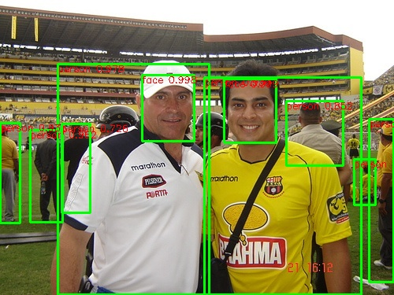

## Training Faster-RCNN on Customer Dataset

This Python implementation is base on [Faster-RCNN](https://github.com/rbgirshick/py-faster-rcnn).

Training Faster-RCNN with VGG-16 on a customer dataset as fallows. 
### Step 1: Download Faster-RCNN:
We'll call the directory that you cloned Faster R-CNN into `Faster-RCNN-root`
    
    git clone --recursive https://github.com/rbgirshick/py-faster-rcnn.git
    cd $Faster-RCNN-root/lib 
    make
    cd $Faster-RCNN-root/caffe-fast-rcnn
    cp Makefile.config.example Makefile.config

Then change "Makefile.config" : first, uncomment "WITH_PYTHON_LAYER := 1" then uncomment "USE_CUDNN := 1" if you'd like to use GPU (recommended), I assume you've already installed GPU, CUDA, cuDNN. You may also need to add hdf5 path to your Libraries directory.

    make all -j8 && make pycaffe

### Step 2: Download models and run a demo

    cd ..
    ./data/scripts/fetch_faster_rcnn_models.sh
    ./data/scripts/fetch_imagenet_models.sh

run demo.py by "python ./tools/demo.py --gpu 1 --net vgg16".
if your server without GUI, you may run mydemo.py by "python ./tools/mydemo.py --gpu 1 --net vgg16", then the result will be saved at "$Faster-RCNN-root/data/demo_result" directory.

### Step 3: Prepare to train your model. 

My strategy is to prepare the data as the same format as the pascal_voc data. First, download pascal_voc data: 

	wget http://host.robots.ox.ac.uk/pascal/VOC/voc2007/VOCtrainval_06-Nov-2007.tar
	wget http://host.robots.ox.ac.uk/pascal/VOC/voc2007/VOCtest_06-Nov-2007.tar
	wget http://host.robots.ox.ac.uk/pascal/VOC/voc2007/VOCdevkit_08-Jun-2007.tar
	tar xvf VOCtrainval_06-Nov-2007.tar
	tar xvf VOCtest_06-Nov-2007.tar
	tar xvf VOCdevkit_08-Jun-2007.tar

Then you should linke this dataset with py-faster-rcnn: 

	cd $Faster-RCNN-root/data

	ln -s $/THE-PATH-OF-DIRECTORY/VOCdevkit VOCdevkit2007

### Step 4: Prepare your own dataset

(1) Transform your data into the format of VOC2007. The pascal voc 2007 dataset are composed of three folders: Annotations, ImageSets, JPEGImages, as shown in Fig(a). You should build your own dataset like this. The annotations file should be ".xml" format named by image name, each sample own a xml file as shown in Fig(b), and the file .xml formate like Fig(c),Fig(d). Then you divide your dataset into trainval, val, train, test four part and save them in the ImageSets folder like Fig(e) and each file formate just like Fig(g) save the image name without filename extension. Then you delete the original "VOC2007" folder inside the "VOCdevkit" folder with the new dataset folder you just created. 

### Step 5: Modify multiple files
(1) change the file "$Faster-RCNN-root/lib/datasets/pascal_voc.py" line 30 "self._classes" to the actuall classes of your datasets such as 5.

Since you are using a different dataset, the number of classes might be different and the format of your picture might also be different from ".jpg", so you may also need to change "self._image_ext = '.jpg'" accordingly. 

(2) comment "$Faster-RCNN-root/lib/datasets/imdb.py" line 111 "assert ..." and add these codes below:

    for k in range(boxes.shape[0]):
	    if boxes[k, 0] > boxes[k, 2]:
    	          boxes[k, 0] = 0

(3) File "$Faster-RCNN-root/lib/rpn/proposal_target_layer.py" line 124 should be "cls = int(clss[ind])" and line 166 should be "...size=int(fg_rois_per_this_image),..." and line 184 should be "labels[int(fg_rois_per_this_image):] = 0"
and line 177 should be " ... size=int(bg_rois_per_this_image), ...". 

(4) change the number of classes in your "models/pascal_voc/faster_rcnn_end2end" prototxt file. The original 21 and 84 should be replaced with new numbers such as 5 ,20.

(5) In lib/fast_rcnn/train.py line 18 import google.protobuf.text_format as text_format, then change the line 51 "pb2.text_format..." as "text_format..."

(6) In "$Faster-RCNN-root/experiments/scripts/faster_rcnn_end2end.sh" change exec &> >(tee -a "$LOG") to exec 2>&1 1>> $LOG

### Step 6: Train your model!
Before training your model, remember to delete the file "data/cache/*", in case you have any previous training.
	
	cd $Faster-RCNN-root
	./experiments/scripts/faster_rcnn_end2end.sh 1 VGG16 pascal_voc
	1 means select the #1 GPU.

Then the training model will be saved in "$Faster-RCNN-root/output/" folder.

### demo
 
 
 
### Evaluation time cost
    110ms/eval on GPU

### Citing Faster-RCNN

    @inproceedings{renNIPS15fasterrcnn,
        Author = {Shaoqing Ren and Kaiming He and Ross Girshick and Jian Sun},
        Title = {Faster {R-CNN}: Towards Real-Time Object Detection
                 with Region Proposal Networks},
        Booktitle = {Advances in Neural Information Processing Systems ({NIPS})},
        Year = {2015}
    }
